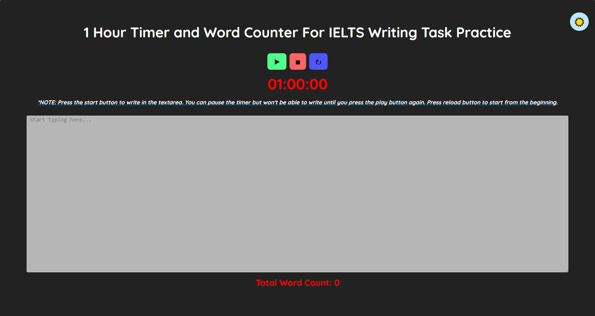
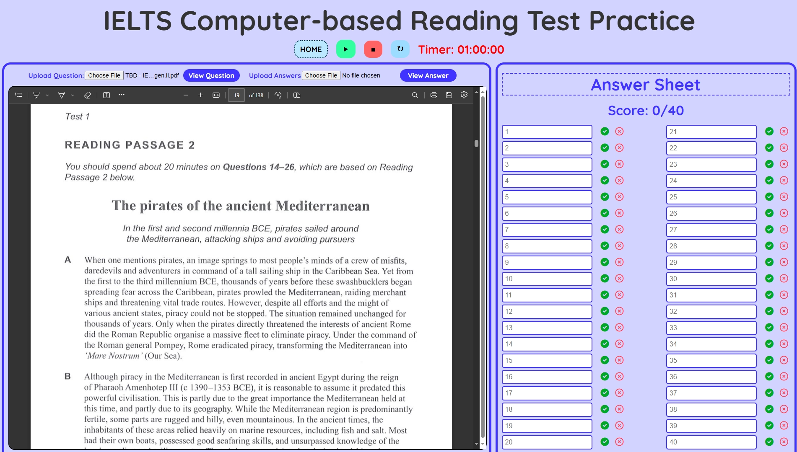

# Computer-based IELTS Module Practice Web Application
<div align="center">

[](LICENSE)


</div>

This web application is designed to help users prepare for the IELTS reading, listening, and writing modules by simulating real test conditions. The app offers interactive features such as a countdown timer, PDF question uploads, and real-time word count tracking to create an efficient and effective learning experience.


<h2>Screenshots</h2>
<b>Writing Module:</b>
</br>
<b>Reading Module:</b>



## Features

### 🌟 General
- **Light/Dark Mode Toggle**: Switch between light and dark themes for comfortable reading and improved focus.
- **Easy Reload**: Quickly reset the timer and clear the text area or uploaded PDFs for a fresh start with one click.

### ✍️ Writing Module
(Already Published)
- **One-Hour Timer**: Simulate a real exam environment with a one-hour countdown timer.
- **Real-Time Word Count**: Track your word count in real-time to ensure you meet the required word limits.
- **Text Input Field**: Practice writing tasks with a large input area for your responses.

### 📖 Reading Module
(Already Published)
- **PDF Upload**: Upload reading test questions and answers in PDF format.
- **PDF Viewer**: View the uploaded PDF questions and answers directly within the application.
- **Answer Sheet**: An interactive answer sheet with 40 fields to input your answers.

### 🎧 Listening Module
(Will be Published soon)
- **Audio and PDF Upload**: Upload the listening test audio file and questions in PDF format.
- **Audio Player**: Play uploaded audio files for listening practice.
- **Answer Sheet**: Similar to the reading module, an answer sheet is provided to input answers during the test.

## How to Use
1. **Upload PDFs**: Select and upload the reading or listening test question PDFs and audio files.
2. **Start the Timer**: Begin your timed practice by clicking the start button, and watch the timer count down.
3. **View Questions**: Use the "View" buttons to display the uploaded questions or answers in the integrated PDF viewer.
4. **Write and Submit**: In the writing module, practice your responses while monitoring the real-time word count.
5. **Light/Dark Mode**: Toggle between themes using the button at the top of the page for a customized experience.

## Installation and Setup

1. Clone this repository:
    ```bash
    git clone https://github.com/Mubashir42884/Computer-based-IELTS-Module-Practice-WebApp.git
    ```

2. Navigate to the project folder:
    ```bash
    cd Computer-based-IELTS-Module-Practice-WebApp
    ```

3. Open `index.html` in your preferred browser:
    ```bash
    open index.html
    ```

## Future Enhancements
- **Feedback System**: An upcoming feature where users will receive feedback and band score predictions for their writing tasks using ChatGPT.

## 🛡️ License

This project is licensed under the **MIT License**. 
[](LICENSE)


## Contributions
Feel free to submit pull requests or create issues if you want to contribute or encounter any problems.

---

**Built with ❤️ by [Mubashir Mohsin](https://github.com/Mubashir42884)**

